# Architecture Documentation

## System Overview

Cryptoon is a Web3 manga/webtoon reader built on Base Sepolia using Coinbase Developer Platform. It's designed as a freemium reader where:
- **All chapters except the latest are free** for everyone
- **Latest chapter requires payment** (0.01 USDC) to support creators
- **100% of payments go directly to creators** (zero commission)
- **Community-focused** - Not a closed marketplace, but an open reader platform

---

## Component Architecture

### Frontend (Next.js 14 + TypeScript)

```
client/
├── app/
│   ├── page.tsx              # Homepage with series browsing
│   ├── layout.tsx            # Root layout with CDP provider
│   ├── providers.tsx         # CDP Embedded Wallet config
│   ├── settings/page.tsx     # AgentKit configuration UI
│   └── admin/page.tsx        # Testing & monitoring dashboard
├── public/                   # Static assets
└── package.json
```

**Key Dependencies:**
- `@coinbase/cdp-hooks` - React hooks for CDP integration
- `@coinbase/wallet-sdk` - Wallet connectivity
- `next` - React framework
- `tailwindcss` - Styling

**Authentication Flow:**
1. User clicks "Login with CDP"
2. CDP Embedded Wallet modal opens
3. User chooses auth method (email/passkey/social)
4. Wallet created automatically (no seed phrases)
5. Session persisted via CDP hooks

---

### Backend (Node.js + Express)

```
server/
├── index.js              # Main server + x402 endpoints
├── agentWallet.js        # CDP SDK v2 wallet management
├── agentService.js       # Auto-purchase scheduler
├── faucet.js             # CDP Faucet API integration
├── balances.js           # CDP Token Balances API
├── chapters.js           # Content & purchase logic
├── agentSettings.json    # Agent configuration storage
├── agentHistory.json     # Agent purchase history
├── purchases.json        # Manual purchase records
├── favorites.json        # User favorites tracking
└── agentWalletData.json  # Persistent agent wallet (gitignored)
```

**Key Dependencies:**
- `@coinbase/cdp-sdk` - CDP Platform SDK v2
- `viem` - Ethereum utilities (ERC-20 encoding)
- `express` - HTTP server
- `cors` - CORS middleware

---

## Payment Flows

### 1. Manual x402 Payment

```mermaid
sequenceDiagram
    participant User
    participant Frontend
    participant Backend
    participant CDP as CDP x402 Facilitator
    participant Blockchain as Base Sepolia
    
    User->>Frontend: Click "Read Latest Chapter"
    Frontend->>Backend: GET /api/chapters/:seriesId/:chapterId
    Backend->>Backend: Check if purchased
    Backend-->>Frontend: 402 Payment Required<br/>(0.01 USDC)
    Frontend->>User: Show payment modal
    User->>Frontend: Click "Pay 0.01 USDC"
    Frontend->>CDP: Initiate x402 payment
    CDP->>Blockchain: Settle USDC transfer
    Blockchain-->>CDP: Transaction confirmed
    CDP-->>Backend: Payment verified
    Backend->>Backend: Record purchase
    Backend-->>Frontend: Chapter unlocked ✅
    Frontend->>User: Display chapter content
```



**Technical Implementation:**
```javascript
// Backend x402 endpoint
app.get("/api/chapters/:seriesId/:chapterId", (req, res) => {
  const { address, seriesId, chapterId } = req.params;
  
  if (!hasPurchased(address, chapterId)) {
    return res.status(402).json({
      error: "Payment Required",
      price: "0.01 USDC",
      receiver: process.env.RECEIVER_WALLET
    });
  }
  
  // Return chapter content
  res.json({ title, content, images });
});
```

---

### 2. AgentKit Autonomous Payment

```mermaid
flowchart TD
    Start([AgentService<br/>Every 60 seconds]) --> CheckEnabled{Check enabled users<br/>agentSettings.json}
    
    CheckEnabled -->|For each user| GetFavorites[Get favorites<br/>favorites.json]
    
    GetFavorites --> FindChapters[Find unpurchased<br/>latest chapters]
    
    FindChapters --> Validate{Validate}
    
    Validate -->|Check 1| Limit{Monthly spending<br/>limit OK?}
    Limit -->|No| Skip[Skip purchase]
    Limit -->|Yes| Balance{Agent wallet<br/>has USDC + ETH?}
    
    Balance -->|No| Skip
    Balance -->|Yes| Encode[Encode ERC-20<br/>transfer function]
    
    Encode --> SendTx[CDP SDK v2<br/>sendTransaction]
    
    SendTx --> Blockchain[Base Sepolia<br/>Blockchain]
    
    Blockchain --> Record[Record purchase<br/>agentHistory.json]
    
    Record --> Log[Log tx hash &<br/>Basescan link ✅]
    
    Log --> CheckEnabled
    Skip --> CheckEnabled
    
    style Start fill:#e1f5ff
    style Blockchain fill:#fce4ec
    style Log fill:#c8e6c9
    style Skip fill:#ffecb3
```



**Technical Implementation:**
```javascript
// agentWallet.js - Transfer USDC
async function transferUSDC(to, amount) {
  // Encode ERC-20 transfer call
  const data = encodeFunctionData({
    abi: [{ 
      name: 'transfer',
      type: 'function',
      inputs: [
        { name: 'to', type: 'address' },
        { name: 'amount', type: 'uint256' }
      ]
    }],
    functionName: 'transfer',
    args: [to, parseUnits(amount, 6)] // 6 decimals for USDC
  });

  // Send transaction via CDP
  const txResult = await cdpClient.evm.sendTransaction({
    address: agentAccount.address,
    network: "base-sepolia",
    transaction: {
      to: "0x036CbD53842c5426634e7929541eC2318f3dCF7e", // USDC contract
      data: data,
      value: 0n
    }
  });

  return txResult.transactionHash;
}
```

---

## CDP Integration Details

### 1. Embedded Wallet (Client)

**File:** `client/app/providers.tsx`

```typescript
import { CdpProvider } from '@coinbase/cdp-hooks';

<CdpProvider
  projectId="your-project-id"
  chainId={84532} // Base Sepolia
>
  {children}
</CdpProvider>
```

**Authentication Methods:**
- Email + OTP
- Passkey (WebAuthn)
- Social login (Google, Apple)

**No seed phrases** - CDP manages keys securely.

---

### 2. x402 Facilitator (Server)

**File:** `server/index.js`

**Purpose:** Verifies payments and settles transactions on-chain.

**x402 Use Cases in Cryptoon:**

Cryptoon demonstrates the **full versatility of x402 protocol** through three distinct payment scenarios:

#### Use Case 1: Backend Content Access (Traditional)
```javascript
// Pay for latest manga chapter
app.get("/api/chapters/:seriesId/:chapterId", (req, res) => {
  if (!hasPurchased(address, chapterId)) {
    return res.status(402).json({
      error: "Payment Required",
      price: "0.01 USDC",
      receiver: process.env.RECEIVER_WALLET
    });
  }
  res.json({ content, images });
});
```

#### Use Case 2: External Webhook Services (n8n)
```javascript
// Pay for AI chat with manga characters
app.post("/api/chat/:characterId", async (req, res) => {
  if (!hasPaidForChat(address, message)) {
    return res.status(402).json({
      error: "Payment Required",
      price: "0.01 USDC",
      receiver: process.env.RECEIVER_WALLET,
      service: "AI Chat"
    });
  }
  
  // Forward to n8n webhook after payment
  const aiResponse = await fetch("https://n8n-instance.com/webhook/chat", {
    method: "POST",
    body: JSON.stringify({ characterId, message })
  });
  
  res.json(await aiResponse.json());
});
```

#### Use Case 3: Autonomous Agent Payments (AgentKit)
```javascript
// AgentKit auto-purchases chapters without user approval
async function agentPurchaseChapter(seriesId, chapterId) {
  // Agent makes x402 payment automatically
  const txHash = await transferUSDC(
    process.env.RECEIVER_WALLET,
    "0.01"
  );
  
  // Record purchase
  recordAgentPurchase({ seriesId, chapterId, txHash });
}
```

**Flow:**
1. User/Agent initiates payment from frontend/backend
2. CDP facilitator validates signature
3. Facilitator submits transaction to blockchain
4. Backend confirms payment via webhook/polling
5. Content/service unlocked

**Benefits:**
- No gas fees for users (CDP pays)
- Instant verification
- Automatic retry logic
- Works for both manual and autonomous payments

---

### 3. AgentKit (CDP SDK v2)

**File:** `server/agentWallet.js`

**Initialization:**
```javascript
import { CdpClient } from '@coinbase/cdp-sdk';

const cdpClient = new CdpClient({
  apiKeyId: process.env.CDP_API_KEY_ID,
  apiKeySecret: process.env.CDP_API_KEY_SECRET,
  walletSecret: process.env.CDP_WALLET_SECRET
});

// Create or restore wallet
const agentAccount = await cdpClient.evm.createAccount({
  network: "base-sepolia"
});
```

**Capabilities:**
- Autonomous USDC transfers
- Balance checking via REST API
- Transaction signing
- Persistent wallet (saved to `agentWalletData.json`)

---

### 4. Faucet API

**File:** `server/faucet.js`

**Purpose:** Distribute testnet USDC/ETH for testing.

**Usage:**
```javascript
// Request USDC
await requestFaucet(address, apiKeyId, apiKeySecret);

// Request ETH (for gas)
await requestEthFaucet(address, apiKeyId, apiKeySecret);
```

**Rate Limits:**
- 1 USDC per request
- 10 USDC per 24 hours per address

---

### 5. Token Balances API

**File:** `server/balances.js` & `server/agentWallet.js`

**Purpose:** Query USDC balance in real-time.

**Implementation:**
```javascript
const response = await fetch(
  `https://api.cdp.coinbase.com/platform/v2/evm/token-balances/base-sepolia/${address}`,
  {
    headers: {
      'Authorization': `Bearer ${jwt}`,
      'Content-Type': 'application/json'
    }
  }
);

const data = await response.json();
const usdcBalance = data.balances.find(
  b => b.contractAddress === "0x036CbD53842c5426634e7929541eC2318f3dCF7e"
);
```

---

### 6. AI Recommendations (n8n + OpenAI)

**Purpose:** Provide personalized manga/webtoon recommendations based on user preferences.

**Architecture:**


**Implementation:**


*Complete n8n workflow for AI-powered recommendations*


*Webhook trigger details for real-time recommendations*

**Features:**
- Real-time recommendations via webhook
- OpenAI integration for intelligent suggestions
- Personalized based on reading history
- Genre-based filtering
- Popularity scoring

**Endpoint:**
```javascript
// n8n webhook endpoint (actual implementation)
POST https://n8n.arroz.dev/webhook/cryptoon-recommendation

// Request body (from server/index.js)
{
  "userId": "0xUserAddress",
  "prompt": "I want to read something about time traveling",  // User's natural language request
  "paid": true,
  "amount": "0.01 USDC",
  "timestamp": "2025-11-23T04:30:00.000Z"
}

// Response (n8n + OpenAI analyzes platform's manga catalog and responds)
[
  {
    "output": "Based on your interest in time traveling, I highly recommend 'Chronos Paradox'! It's a thrilling sci-fi manga that explores time travel paradoxes with complex character development. The series is available on our platform with the first 4 chapters free to read. You'll love how it handles temporal mechanics and the consequences of changing the past."
  }
]

// The AI analyzes:
// - Available manga series on the platform
// - User's natural language prompt
// - Series genres, themes, and descriptions
// - Returns personalized recommendation from platform catalog

// Alternative response formats supported:
{
  "output": "recommendation text"
}
// or
{
  "recommendation": "recommendation text"
}
// or
{
  "message": "recommendation text"
}
```

**How It Works:**

1. User asks in natural language: "I want to read something about time traveling"
2. Backend sends prompt to n8n webhook with payment verification
3. n8n workflow passes prompt to Gemini with context about platform's manga catalog
4. Gemini analyzes available series and generates personalized recommendation
5. Response recommends actual manga available on Cryptoon platform
6. Frontend displays AI-generated recommendation to user

**Backend Processing (server/index.js):**
```javascript
const webhookResponse = await fetch('https://n8n.arroz.dev/webhook/cryptoon-recommendation', {
  method: 'POST',
  headers: { 'Content-Type': 'application/json' },
  body: JSON.stringify({
    userId,
    prompt,
    paid: true,
    amount: "0.01 USDC",
    timestamp: new Date().toISOString()
  })
});

const webhookData = await webhookResponse.json();

// Extract recommendation from various response formats
let recommendation = "Recommendation generated successfully!";
if (Array.isArray(webhookData) && webhookData.length > 0 && webhookData[0].output) {
  recommendation = webhookData[0].output;
```

**Status:** ✅ Functional (n8n workflow deployed)

---

### 7. AI Chat Assistant (x402 + n8n)

**Purpose:** Demonstrate x402 versatility by implementing pay-per-query AI chat with manga characters via external n8n webhook.

**Why This Feature Matters:**

This showcases **three distinct x402 use cases in one platform**:

1. **Backend Content Access** - Traditional server API payments (chapters)
2. **External Webhook Services** - Pay for third-party n8n + OpenAI calls (chat)
3. **Autonomous Agents** - AgentKit automated payments (auto-purchase)

**Architecture:**


**Implementation Details:**

**Pricing Model:**
- **Chapter Access:** 0.01 USDC (backend content)
- **AI Chat:** 0.01 USDC per message (external webhook)
- **Auto-Purchase:** 0.01 USDC (AgentKit autonomous)

**Backend Endpoint:**
```javascript
// server/index.js
app.post("/api/chat/:characterId", async (req, res) => {
  const { address, characterId } = req.params;
  const { message } = req.body;
  
  // x402 payment check
  if (!hasPaidForChat(address, message)) {
    return res.status(402).json({
      error: "Payment Required",
      price: "0.01 USDC",
      receiver: process.env.RECEIVER_WALLET,
      service: "AI Chat with Character"
    });
  }
  
  // Forward to n8n webhook
  const response = await fetch("https://n8n-instance.com/webhook/character-chat", {
    method: "POST",
    headers: { "Content-Type": "application/json" },
    body: JSON.stringify({
      characterId,
      userMessage: message,
      context: getCharacterContext(characterId)
    })
  });
  
  const aiResponse = await response.json();
  res.json({ message: aiResponse.reply });
});
```

**n8n Webhook Flow:**
1. Receive character ID + user message
2. Load character personality prompt
3. Call OpenAI API with context
4. Return character-appropriate response
5. Track usage for cost analysis

**Use Cases:**
- "Ask Chronos about time travel paradoxes"
- "Get writing tips from the creator persona"
- "Chat with villain about their motivations"

**Revenue Model:**
- 0.01 USDC covers:
  - n8n hosting costs (~$0.002)
  - OpenAI API call (~$0.006)
  - Platform fee (~$0.002)

**Status:** ✅ Functional (x402 + n8n integration deployed)

---

## Data Storage

### JSON Files (Development)

**Location:** `server/`

1. **agentSettings.json**
   ```json
   {
     "0xUserAddress": {
       "enabled": true,
       "monthlyLimit": 1.0
     }
   }
   ```

2. **agentHistory.json**
   ```json
   {
     "0xUserAddress": [
       {
         "seriesId": 1,
         "chapterId": 5,
         "timestamp": "2025-11-23T04:30:00Z",
         "amount": 0.01,
         "txHash": "0xabc123...",
         "status": "success"
       }
     ]
   }
   ```

3. **purchases.json**
   ```json
   {
     "0xUserAddress": {
       "series1_chapter5": {
         "timestamp": "2025-11-23T03:15:00Z",
         "amount": 0.01,
         "txHash": "0xdef456..."
       }
     }
   }
   ```

4. **favorites.json**
   ```json
   {
     "0xUserAddress": [1, 3, 5]
   }
   ```

5. **agentWalletData.json** (Sensitive - Gitignored)
   ```json
   {
     "address": "0xAgentAddress",
     "network": "base-sepolia",
     "createdAt": "2025-11-23T04:31:08.380Z"
   }
   ```

**Production:** Migrate to PostgreSQL/MongoDB.

---

## Security Considerations

### Sensitive Files (Must be Gitignored)

- `server/.env` - API credentials
- `server/agentWalletData.json` - Wallet keys

**Verification:**
```bash
./check-readiness.sh
```

### API Key Permissions

CDP API keys should have:
- ✅ Faucet access
- ✅ Token Balances read
- ✅ Transaction sending
- ❌ Admin operations

### Agent Wallet Funding

The agent wallet needs:
- **USDC** - For purchasing chapters (~1 USDC)
- **ETH** - For gas fees (~0.001 ETH)

**Why ETH?** Even though CDP facilitator can sponsor gas, `sendTransaction()` requires some ETH in the wallet.

---

## Testing & Monitoring

### Admin Dashboard (`/admin`)

**Features:**
- Real-time agent wallet balance (5s refresh)
- Fund agent with USDC button
- Fund agent with ETH button
- Basescan verification link
- Reset testing data button
- Purchase history viewer

**Usage:**
1. Open http://localhost:3000/admin
2. Fund agent wallet (USDC + ETH)
3. Monitor live balance updates
4. Verify transactions on Basescan
5. Reset data between tests

---

### Settings Page (`/settings`)

**Features:**
- Enable/disable auto-purchase toggle
- Monthly spending limit slider
- Purchase history with tx links
- Monthly spending progress bar

**Usage:**
1. Toggle "Enable Auto-Purchase" ON
2. Set monthly limit (default 1 USDC)
3. Mark series as favorites (⭐)
4. Agent auto-buys new chapters every 60s

---

## Network Configuration

### Base Sepolia Testnet

- **Chain ID:** 84532
- **RPC:** https://sepolia.base.org
- **Explorer:** https://sepolia.basescan.org/
- **USDC Contract:** 0x036CbD53842c5426634e7929541eC2318f3dCF7e

### Transaction Costs

- **Average Gas:** ~0.0001 ETH (~$0.0002 USD)
- **CDP Sponsored:** Gas paid by facilitator (when using x402)
- **Agent Transfers:** Requires ETH in agent wallet

---

## Deployment Considerations

### Environment Variables

**Server:**
- `RECEIVER_WALLET` - Creator wallet address
- `CDP_API_KEY_ID` - CDP API credentials
- `CDP_API_KEY_SECRET` - CDP API credentials
- `CDP_WALLET_SECRET` - Agent wallet secret
- `PORT` - Server port (default 3001)

**Client:**
- `NEXT_PUBLIC_API_URL` - Backend URL
- `NEXT_PUBLIC_CHAIN_ID` - Network chain ID

### Scaling Recommendations

1. **Database:** Migrate from JSON to PostgreSQL
2. **Storage:** Move chapter images to IPFS/Arweave
3. **Caching:** Add Redis for balance queries
4. **Monitoring:** Integrate Datadog/Sentry
5. **CI/CD:** GitHub Actions for testing

---

## Future Enhancements

### Phase 2
- [x] AI recommendations (n8n + OpenAI) - ✅ Completed
- [ ] Multi-creator routing
- [ ] Creator analytics dashboard
- [ ] IPFS integration for images

### Phase 3
- [ ] Mainnet deployment (Base)
- [ ] Mobile responsive design
- [ ] Advanced search/filters
- [ ] Subscription tiers

### Phase 4
- [ ] Farcaster Frames integration
- [ ] Cross-chain support (Optimism, Arbitrum)
- [ ] NFT minting for collectors
- [ ] Creator DAOs for governance

---

## Troubleshooting

### Agent Not Purchasing

**Check:**
1. Is auto-purchase enabled in `/settings`?
2. Does agent wallet have USDC + ETH?
3. Are there unpurchased premium chapters?
4. Is monthly limit reached?
5. Check server logs for errors

**Logs:**
```bash
cd server && npm run dev
# Look for:
# "🛒 Attempting to purchase..."
# "✅ Transfer successful!"
# OR
# "❌ Purchase failed: ..."
```

### Payment Failures

**Common Issues:**
1. **Insufficient balance** - Fund user wallet via faucet
2. **Network congestion** - Wait and retry
3. **x402 facilitator error** - Check CDP API credentials
4. **Wrong network** - Verify Base Sepolia (Chain ID 84532)

### Basescan Verification

**View transactions:**
1. Copy wallet address
2. Go to https://sepolia.basescan.org/
3. Paste address in search
4. View transactions/token transfers

---

**Last Updated:** November 23, 2025  
**Version:** 1.0.0 (Hackathon MVP)
